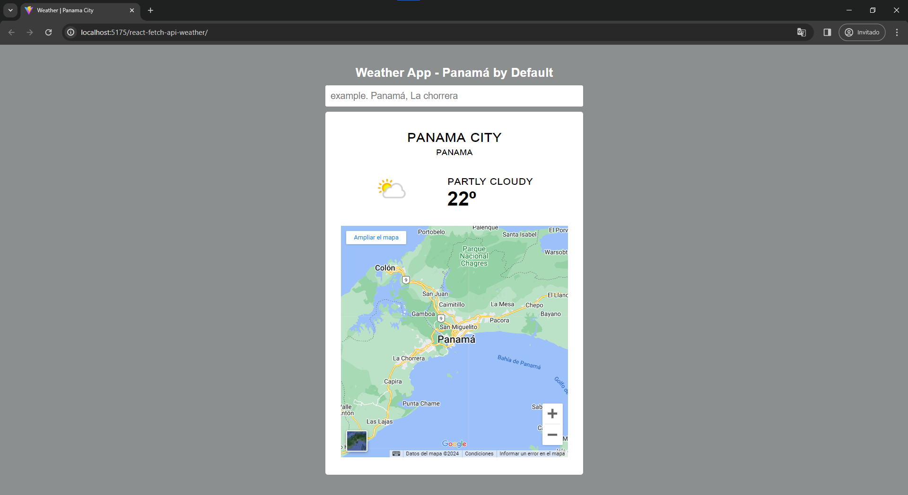

# App de clima

## Bienvenido!👋

Aqui puedes ver el resultado final -> [https://Anell-dev.github.io/react-fetch-api-weather/](https://Anell-dev.github.io/react-fetch-api-weather/)

### El Proyecto consiste en

- Ser capaz de hacer prompt de una cualquiera localidad del mundo y poder ver informacon basica del clima
- Ser capaz de ver la localidad en el mapa gracias a la API de Google

### Construido con

- React
- JavaScript
- CSS - Flexbox
- HTML

### Conceptos aplicados

- Instalacion, Ejecucion y
- Empaquetador de ViteJs
- Modulos de CSS para componentes de React
- Conceptos de React como UseEffect, UseState, ConditionalRender
- Instalacion de dependencias en el package.json
- Varibales de entorno (.env) para las llaves privadas
- Deploy de una APP en GitHub-Pages

### Captura de pantalla

